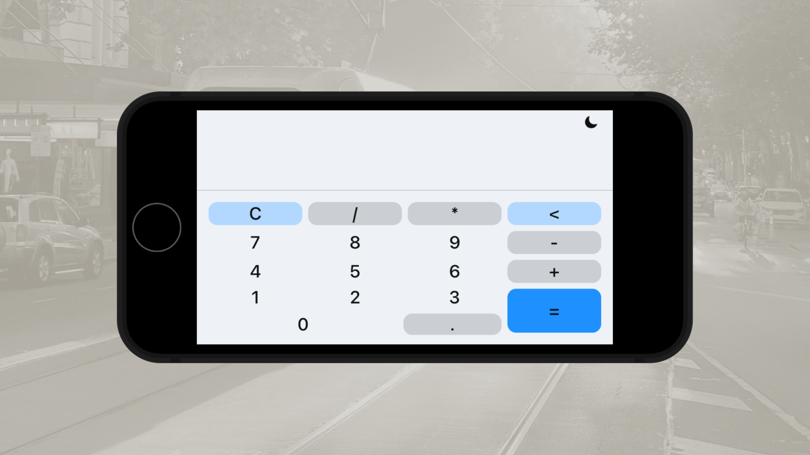

<h1 align="center">
Calculator App With SwiftUI, Apple Human Design Guideline, UserDefaults, XCTest, MVVM, XCUIApplication
</h1>

 

 

  <a href="#description">✍️ Description</a> &nbsp;&nbsp;&nbsp;|&nbsp;&nbsp;&nbsp <a href="#technologies">🚀 Technologies</a>

 
 

<h3 id="description">✍️ Description:</h3>

This project is built using SwiftUI and follows the Model-View-ViewModel (MVVM) architectural pattern to provide a predictable and maintainable state management flow. The main goal was to create a calculator application with a clear separation between user intentions, state transformations, and UI rendering, resulting in a scalable and testable codebase. Following Apple's Human Interface Guidelines ensures a familiar, accessible, and polished user experience across iOS devices. UserDefaults is leveraged for lightweight persistence of user preferences and calculator history, while XCTest and XCUIApplication are used to implement comprehensive unit and UI testing, validating both business logic and end-to-end user interactions with confidence

 

<h3 id="technologies">🚀 Technologies:</h3>

To build this project is used:

- UserDefaults
- XCTest
- MVVM
- Apple Human Design Guideline
- XCUIApplication
- SwiftUI
- Swift
- Xcode
- Swift Format
